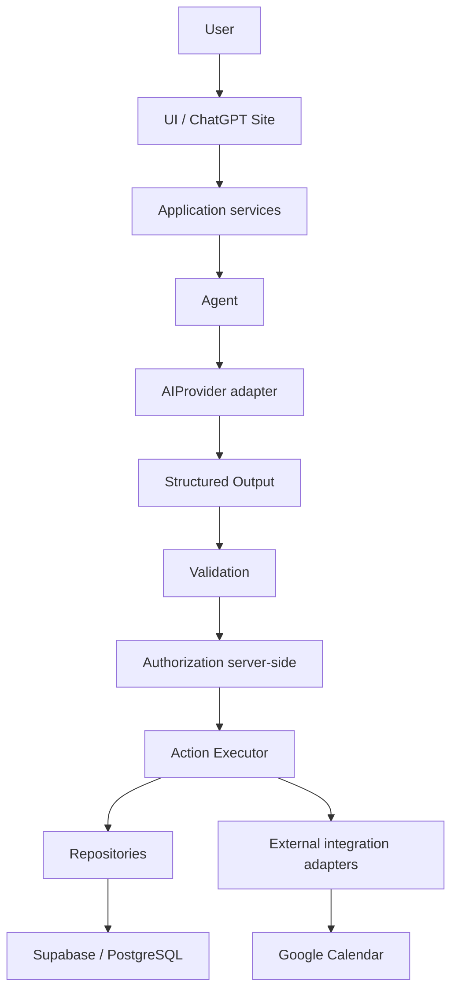

# Arquitetura do Task Agent

**Status da arquitetura:** definida na Fase 0 e preservada nas Fases 1 e 2

**Nome do produto:** provisório

**Estado atual:** Fase 2 concluída; somente a camada visual foi adicionada nesta fase

**Runtime atual:** arquivos HTML e CSS estáticos servidos pelo ChatGPT Sites

## Objetivo

O Task Agent deverá permitir que a pessoa descreva o que precisa fazer em linguagem natural. Um agente de IA interpretará o pedido e proporá dados de tarefa. A aplicação será responsável por validar, autorizar e executar qualquer ação.

Esta arquitetura estabelece limites entre a interface, os casos de uso, o agente, validação, autorização, execução e integrações. O shell atual é estático; serviços, agente, banco, autenticação e integrações continuam planejados, sem implementação.

## Princípio de controle

> A IA interpreta e propõe ações. A aplicação valida, autoriza e executa.

Nenhum modelo terá acesso direto e irrestrito ao banco de dados, ao Google Calendar ou a outra integração. Toda operação deverá percorrer validação e autorização do lado do servidor.

## Fluxo futuro



O diagrama descreve o destino arquitetural, não funcionalidades já disponíveis.

## Camadas e responsabilidades

| Camada | Responsabilidade | Limite principal |
| --- | --- | --- |
| UI / Presentation | Renderizar páginas, navegação e estados da interface. | Não chama LLM, banco ou APIs externas diretamente. |
| Application services | Coordenar casos de uso e dependências do domínio. | Não contém SDK específico de provider ou banco. |
| Domain | Definir conceitos e invariantes do negócio. | Não depende de UI, provider, framework ou persistência. |
| Agent | Interpretar linguagem natural e solicitar uma proposta ao provider configurado. | Não executa ações nem persiste dados. |
| Structured Output | Descrever a intenção e os dados propostos em formato tipado e limitado por schema. | É uma proposta não confiável, nunca um comando executável por si só. |
| Validation | Validar schema, campos, regras de negócio e necessidade de confirmação. | Toda saída do LLM e entrada externa é não confiável. |
| Authentication / Authorization | Obter a identidade autenticada e autorizar cada operação no servidor. | Login não substitui autorização; a UI não é barreira de segurança. |
| Actions / Action Executor | Representar comandos aprovados e encaminhá-los a executores controlados. | Só recebe operações validadas e autorizadas. |
| Repositories | Fornecer acesso a dados por contratos usados pelos casos de uso. | O domínio não depende de detalhes do Supabase/PostgreSQL. |
| Integrations | Isolar providers de IA, Supabase e Google Calendar em adaptadores. | Integrações não são chamadas diretamente pela UI nem pelo domínio. |
| Admin | Concentrar operações administrativas e configuração de providers. | Papel e permissões são conferidos no servidor. |
| Shared / lib | Manter utilitários realmente compartilhados entre módulos. | Não deve virar depósito de regras específicas de um domínio. |
| Observability | Registrar estado, duração, provider/modelo e falhas. | Minimiza prompts, dados pessoais e conteúdo sensível. |

## Agent e providers de IA

O futuro `AgentService` recebe texto do usuário e solicita uma interpretação a uma interface de provider. Ele deverá retornar uma proposta com campos como intenção, confiança, dados candidatos, campos ausentes e indicação de confirmação. A proposta precisa de schema explícito; texto livre não é um comando executável.

O limite `AIProvider` padronizará envio, resposta e erros e informará provider e modelo utilizados. Adaptadores poderão atender DeepSeek, OpenAI, Anthropic ou modelos locais. A escolha inicial de DeepSeek não deverá aparecer nas regras do domínio nem obrigar os serviços da aplicação a conhecer seu SDK.

As chaves ficarão em configuração secreta do servidor. Depois de cadastrada, uma chave não será devolvida integralmente à interface administrativa nem enviada ao navegador.

## Validação, autorização e ações

O fluxo para uma operação futura será:

1. Validar a resposta do provider contra um schema em runtime.
2. Aplicar regras de negócio, verificar campos ausentes e decidir se é necessária confirmação.
3. Identificar o usuário autenticado e conferir, no servidor, se ele pode executar a operação sobre o recurso.
4. Encaminhar somente um comando aprovado ao executor da ação.
5. Usar repositórios ou adaptadores de integração para produzir o efeito externo.

Ações previstas incluem criar, editar, excluir e concluir tarefas, criar projetos e agendar ou reagendar compromissos. Cada ação terá entrada e saída explícitas. Operações sensíveis ou destrutivas devem exigir confirmação conforme suas regras.

## Dados e integrações

O domínio e os casos de uso dependerão de contratos de repositório, e não de chamadas diretas ao Supabase. Quando Supabase/PostgreSQL entrar em uma fase futura, um adaptador implementará esses contratos. A autorização por usuário deverá existir no servidor e ser reforçada por Row Level Security; a interface nunca será a barreira de segurança.

DeepSeek ficará atrás do contrato `AIProvider`. Google Calendar ficará em uma integração independente, chamada por casos de uso e ações autorizadas. A integração com calendário será acrescentada depois que o ciclo básico de tarefas estiver confiável.

## Autenticação, roles e Admin

A autenticação futura usará Sign in with ChatGPT. O identificador estável do usuário autenticado será usado para relacionar dados; o e-mail não será usado como identificador durável. Cada solicitação protegida verificará identidade e autorização no servidor.

Os papéis iniciais previstos são `user` e `admin`. O Admin poderá gerenciar contas e roles, configurar providers e consultar métricas. A interface pode ocultar controles, mas toda permissão administrativa também será aplicada no backend e no banco.

## Segurança e privacidade

- Segredos não entram em código de frontend, armazenamento do navegador, arquivos versionados ou respostas da API.
- Toda entrada externa e toda saída do LLM é validada.
- Ações são autorizadas no servidor e limitadas ao usuário e ao recurso corretos.
- Logs priorizam ação, estado, provider/modelo, duração e erro; conteúdo de mensagens só é mantido se uma necessidade futura justificar isso.
- Credenciais de integração recebem o menor escopo necessário e são mantidas no mecanismo de secrets do servidor.

## Observabilidade

Uma camada de observabilidade futura poderá registrar execuções do agente, provider/modelo, latência, uso, erros, falhas de ações e erros de integração. Os registros devem minimizar conteúdo pessoal e nunca conter API keys ou tokens.

## Organização incremental do código

O shell atual mantém a página e os estilos em `dist/`, servidos diretamente pelo Sites. O starter também contém a estrutura nativa `app/`, `components/` e `lib/`, que foi preservada. Como ainda não há regras de negócio nem integrações funcionais, a Fase 1 não adicionou diretórios vazios ou interfaces sem consumidores. Quando uma funcionalidade entrar no escopo, a separação conceitual deverá continuar permitindo:

```text
app/                 rotas e composição da UI, conforme o starter
components/          componentes de apresentação reutilizáveis
application/         serviços de aplicação e casos de uso
domain/              tipos e invariantes do domínio
agents/              AgentService e contratos de provider
validation/          schemas e regras de validação
auth/                integração de identidade e autorização
actions/              comandos e executores autorizados
repositories/         contratos e acesso a dados
integrations/         adaptadores isolados de providers e APIs externas
admin/                casos de uso administrativos
lib/                  utilitários compartilhados compatíveis com o starter
```

Esses diretórios são pontos de extensão, não uma exigência para criá-los agora. O layout nativo do Sites/Vinext será preservado quando atender à responsabilidade; cada módulo só será criado quando tiver uma implementação real.

Na Fase 2, dist/index.html compõe o shell e as páginas-base; dist/styles.css concentra os tokens e padrões visuais; dist/app.js cuida somente da navegação local por hash e do menu recolhível em telas pequenas. Nenhum serviço de aplicação, domínio, autenticação ou acesso a dados foi adicionado.

## Interface inicial da Fase 2

O shell apresenta uma sidebar, topbar, área de conteúdo e seis destinos: Dashboard, Tarefas, Agente, Calendário, Configurações e Admin. Todos são páginas-base com mensagens vazias explícitas. Admin e a área de conta são apenas espaços visuais; não oferecem gerenciamento, autenticação ou controle de permissões.

A navegação por hash mantém os links utilizáveis e permite atualizar a página ativa sem serviço de roteamento. Em telas estreitas, o menu torna-se um drawer com botão de abertura, fechamento por Escape e retorno de foco. A interface inclui landmarks semânticos, link para pular ao conteúdo, rótulos acessíveis, foco visível e redução de movimento.

dist/styles.css define tokens de cor, tipografia, espaçamento, bordas, foco e sombra. As classes reutilizáveis cobrem layout, botões, campos, cards, badges, tabelas, menus, diálogos, carregamento, estados vazios e avisos de informação, erro e sucesso. Esses padrões são apenas apresentação; não estão conectados a fluxos de produto.

## Decisões estabelecidas e preservadas até a Fase 2

- Manter a camada visual estática em HTML, CSS e JavaScript nativos enquanto não houver regras de negócio ou serviços de servidor.
- Adotar o runtime de aplicação suportado pelo Sites quando uma fase futura exigir lógica de servidor, rotas ou estado interativo.
- Tratar as páginas desta fase como molduras visuais; não simular operações futuras ou dados de negócio.
- Preservar o starter Sites/Vinext e não criar diretórios vazios ou abstrações sem consumidores.
- Não conectar provedor de IA, autenticação, banco, calendário ou painel administrativo nesta fase.

## Estado do escopo

- Fase 0 concluída: fundação e arquitetura documentadas.
- Fase 1 concluída: estrutura existente preservada e projeto versionado na branch `main` do repositório público [`julio7528/flowzenitmvp2`](https://github.com/julio7528/flowzenitmvp2).
- Fase 2 concluída: shell responsivo, navegação pelas páginas-base e padrões visuais reutilizáveis.
- Funcionalidades futuras não implementadas: login, tarefas e CRUD, Supabase, DeepSeek, saída estruturada executável, ações, confirmações funcionais, Google Calendar, administração funcional, logs de execução e arquitetura multiagente.
