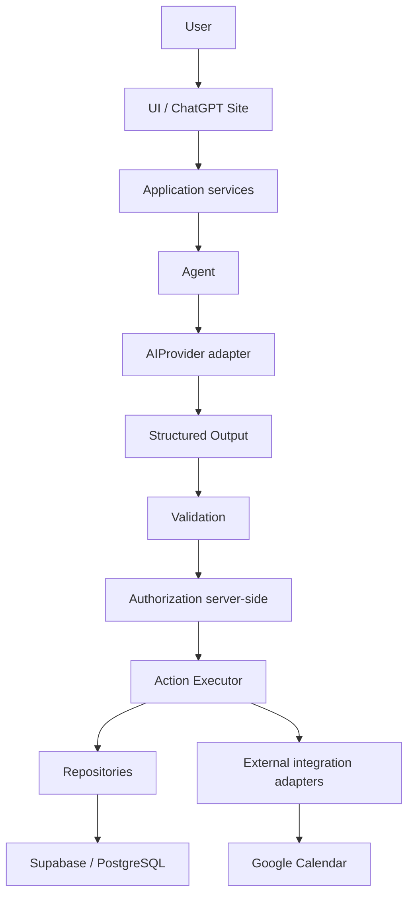

# Arquitetura do Task Agent

**Status da arquitetura:** definida na Fase 0 e evoluída incrementalmente até a Fase 3 concluída

**Nome do produto:** provisório

**Estado atual:** Fase 3 concluída; Fase 4 (Supabase, modelo de dados e RLS) pendente

**Runtime atual:** aplicação Vinext em Cloudflare Worker; as rotas protegidas verificam identidade no servidor

## Objetivo

O Task Agent deverá permitir que a pessoa descreva o que precisa fazer em linguagem natural. Um agente de IA interpretará o pedido e proporá dados de tarefa. A aplicação será responsável por validar, autorizar e executar qualquer ação.

Esta arquitetura estabelece limites entre a interface, os casos de uso, o agente, validação, autorização, execução e integrações. A Fase 3 acrescenta autenticação e controle inicial de acesso; agente, banco, operações de tarefas e integrações continuam planejados.

## Princípio de controle

> A IA interpreta e propõe ações. A aplicação valida, autoriza e executa.

Nenhum modelo terá acesso direto e irrestrito ao banco de dados, ao Google Calendar ou a outra integração. Toda operação deverá percorrer validação e autorização do lado do servidor.

## Fluxo futuro



O diagrama descreve o destino arquitetural, não funcionalidades já disponíveis.

## Camadas e responsabilidades

| Camada | Responsabilidade | Limite principal |
| --- | --- | --- |
| UI / Presentation | Renderizar páginas, navegação e estados da interface. | Não chama LLM, banco ou APIs externas diretamente. |
| Application services | Coordenar casos de uso e dependências do domínio. | Não contém SDK específico de provider ou banco. |
| Domain | Definir conceitos e invariantes do negócio. | Não depende de UI, provider, framework ou persistência. |
| Agent | Interpretar linguagem natural e solicitar uma proposta ao provider configurado. | Não executa ações nem persiste dados. |
| Structured Output | Descrever a intenção e os dados propostos em formato tipado e limitado por schema. | É uma proposta não confiável, nunca um comando executável por si só. |
| Validation | Validar schema, campos, regras de negócio e necessidade de confirmação. | Toda saída do LLM e entrada externa é não confiável. |
| Authentication / Authorization | Obter a identidade do Sites, mapeá-la para o usuário interno e autorizar rotas e operações no servidor. | Login não substitui autorização; a UI não é barreira de segurança. |
| Actions / Action Executor | Representar comandos aprovados e encaminhá-los a executores controlados. | Só recebe operações validadas e autorizadas. |
| Repositories | Fornecer acesso a dados por contratos usados pelos casos de uso. | O domínio não depende de detalhes do Supabase/PostgreSQL. |
| Integrations | Isolar providers de IA, Supabase e Google Calendar em adaptadores. | Integrações não são chamadas diretamente pela UI nem pelo domínio. |
| Admin | Concentrar operações administrativas e configuração de providers. | Papel e permissões são conferidos no servidor. |
| Shared / lib | Manter utilitários realmente compartilhados entre módulos. | Não deve virar depósito de regras específicas de um domínio. |
| Observability | Registrar estado, duração, provider/modelo e falhas. | Minimiza prompts, dados pessoais e conteúdo sensível. |

## Agent e providers de IA

O futuro `AgentService` recebe texto do usuário e solicita uma interpretação a uma interface de provider. Ele deverá retornar uma proposta com campos como intenção, confiança, dados candidatos, campos ausentes e indicação de confirmação. A proposta precisa de schema explícito; texto livre não é um comando executável.

O limite `AIProvider` padronizará envio, resposta e erros e informará provider e modelo utilizados. Adaptadores poderão atender DeepSeek, OpenAI, Anthropic ou modelos locais. A escolha inicial de DeepSeek não deverá aparecer nas regras do domínio nem obrigar os serviços da aplicação a conhecer seu SDK.

As chaves ficarão em configuração secreta do servidor. Depois de cadastrada, uma chave não será devolvida integralmente à interface administrativa nem enviada ao navegador.

## Validação, autorização e ações

O fluxo para uma operação futura será:

1. Validar a resposta do provider contra um schema em runtime.
2. Aplicar regras de negócio, verificar campos ausentes e decidir se é necessária confirmação.
3. Identificar o usuário autenticado e conferir, no servidor, se ele pode executar a operação sobre o recurso.
4. Encaminhar somente um comando aprovado ao executor da ação.
5. Usar repositórios ou adaptadores de integração para produzir o efeito externo.

Ações previstas incluem criar, editar, excluir e concluir tarefas, criar projetos e agendar ou reagendar compromissos. Cada ação terá entrada e saída explícitas. Operações sensíveis ou destrutivas devem exigir confirmação conforme suas regras.

## Dados e integrações

O domínio e os casos de uso dependerão de contratos de repositório, e não de chamadas diretas ao Supabase. Quando Supabase/PostgreSQL entrar em uma fase futura, um adaptador implementará esses contratos. A autorização por usuário deverá existir no servidor e ser reforçada por Row Level Security; a interface nunca será a barreira de segurança.

DeepSeek ficará atrás do contrato `AIProvider`. Google Calendar ficará em uma integração independente, chamada por casos de uso e ações autorizadas. A integração com calendário será acrescentada depois que o ciclo básico de tarefas estiver confiável.

## Autenticação, roles e Admin

### Fluxo implementado na Fase 3

O app usa o cliente Sign in with ChatGPT já associado ao Site e os caminhos nativos do Sites: `/signin-with-chatgpt`, `/callback` e `/signout-with-chatgpt`. `app/chatgpt-auth.ts` é o adaptador do provider: no servidor, lê os cabeçalhos de identidade que o runtime autenticado do Sites encaminha. O identificador externo é obrigatório; e-mail e nome completo podem não estar presentes. O adaptador atual não fornece foto de perfil.

`auth/auth-service.ts` traduz essa identidade para `AuthenticatedUser` (`externalUserId`, `name`, `email`, `role`). Componentes de UI recebem somente os campos de apresentação e a role; o ID externo permanece no servidor para resolver a permissão e não é serializado ao navegador. A UI não lê cabeçalhos do provider. O serviço expõe `getCurrentUser`, `signIn`, `signOut`, `requireAuth` e `requireRole`; `auth/authorization.ts` separa a verificação de role com `hasRole`.

O layout `app/(protected)/[section]/layout.tsx` exige identidade no servidor antes de compor a interface. Isso cobre Dashboard, Tarefas, Agente, Calendário, Configurações, Admin e acesso negado. A raiz redireciona para Dashboard e usuários anônimos são enviados ao caminho nativo de entrada. Como a verificação lê `headers()` durante cada solicitação, o conteúdo protegido não é renderizado antes da autenticação e a página não depende de um bloqueio no cliente.

### Sessão e identidade

O ChatGPT Sites controla o ciclo da sessão. O app redireciona para o endpoint nativo de entrada/saída e recebe os dados de identidade verificados pelo runtime em cada solicitação. Não lê nem grava tokens, cookies de sessão ou cabeçalhos `Authorization` no browser, `localStorage`, logs ou respostas da UI. Esse limite pressupõe que o app seja servido pelo runtime do Sites; executar o Worker fora da borda autenticada do Sites não é um modo de implantação suportado.

Nome e e-mail são opcionais e usados só para apresentação quando o Sites os entrega. Sem nome/e-mail, a UI mostra um fallback neutro. A origem não entrega `avatar_url` ao adaptador da aplicação; portanto, nenhum avatar é inventado ou exibido como se viesse do provider.

Não há persistência de perfil nesta fase. `FutureProfileRecord` documenta o formato conceitual para uma fase futura: `id`, `external_user_id`, `name`, `email`, `avatar_url`, `role`, `status`, `created_at`, `updated_at` e `last_login_at`. Os campos ainda não são gravados no Supabase nem em outro banco.

### Roles e autorização

As roles são `user` e `admin`. `roleForExternalUser` atribui `user` por padrão e só reconhece `admin` quando o identificador externo corresponde exatamente à lista configurada no runtime do Worker por `TASK_AGENT_ADMIN_EXTERNAL_USER_IDS` (IDs separados por vírgula). A variável é opcional, fica somente no runtime do Sites e não há administrador inicial configurado. Ela pode ser definida nas configurações de ambiente do Site antes de conceder acesso administrativo.

O shell só renderiza o link Admin para `admin`, mas isso é apenas apresentação. A página `/admin` chama `requireRole("admin", "/admin")` no servidor; uma pessoa autenticada como `user` recebe a página de acesso restrito mesmo que digite o endereço. A tela Admin continua vazia e não oferece gerenciamento. As futuras operações administrativas também deverão exigir a role no backend e nas políticas do banco quando houver persistência.

O preview local usa apenas o mock de desenvolvimento já fornecido pelo plugin Sites; ele remove cabeçalhos `oai-authenticated-user-*` enviados pelo cliente e gera um usuário local de teste. Essa simulação não participa do build nem do Site publicado e não substitui a verificação do endpoint nativo de autenticação.

## Segurança e privacidade

- Segredos não entram em código de frontend, armazenamento do navegador, arquivos versionados ou respostas da API.
- Toda entrada externa e toda saída do LLM é validada.
- Ações são autorizadas no servidor e limitadas ao usuário e ao recurso corretos.
- Logs priorizam ação, estado, provider/modelo, duração e erro; conteúdo de mensagens só é mantido se uma necessidade futura justificar isso.
- Credenciais de integração recebem o menor escopo necessário e são mantidas no mecanismo de secrets do servidor.

## Observabilidade

Uma camada de observabilidade futura poderá registrar execuções do agente, provider/modelo, latência, uso, erros, falhas de ações e erros de integração. Os registros devem minimizar conteúdo pessoal e nunca conter API keys ou tokens.

## Organização incremental do código

O shell visual da Fase 2 foi migrado de `dist/` para a estrutura nativa `app/` e `components/` porque a Fase 3 exige verificação server-side. O Sites agora usa o runtime Worker, sem declarar a pasta estática como entrada. A separação conceitual deverá continuar permitindo:

```text
app/                 rotas e composição da UI, conforme o starter
components/          componentes de apresentação reutilizáveis
application/         serviços de aplicação e casos de uso
domain/              tipos e invariantes do domínio
agents/              AgentService e contratos de provider
validation/          schemas e regras de validação
auth/                integração de identidade e autorização
actions/              comandos e executores autorizados
repositories/         contratos e acesso a dados
integrations/         adaptadores isolados de providers e APIs externas
admin/                casos de uso administrativos
lib/                  utilitários compartilhados compatíveis com o starter
```

Esses diretórios são pontos de extensão, não uma exigência para criá-los agora. O layout nativo do Sites/Vinext será preservado quando atender à responsabilidade; cada módulo só será criado quando tiver uma implementação real.

`app/` contém rotas server-rendered e composição; `components/` contém o shell, menu de usuário, botão de entrada e ícones; `auth/` contém a identidade interna e as regras iniciais de autorização. `app/globals.css` preserva os tokens e padrões visuais da Fase 2. `dist/` é somente saída gerada do Worker e não é fonte de interface nem parte do controle de versão.

## Interface inicial da Fase 2

O shell apresenta sidebar, topbar, menu da conta e seis destinos: Dashboard, Tarefas, Agente, Calendário, Configurações e Admin. Os cinco primeiros são páginas-base com mensagens vazias explícitas. Admin permanece sem ferramentas e agora exige role no servidor.

A navegação usa rotas do App Router, mantendo o shell visual e o drawer responsivo da Fase 2. Em telas estreitas, o menu tem botão de abertura, fechamento por Escape e retorno de foco. A interface inclui landmarks semânticos, link para pular ao conteúdo, rótulos acessíveis, foco visível e redução de movimento.

`app/globals.css` define tokens de cor, tipografia, espaçamento, bordas, foco e sombra. As classes reutilizáveis cobrem layout, botões, campos, cards, badges, tabelas, menus, diálogos, carregamento, estados vazios e avisos de informação, erro e sucesso. Esses padrões são apenas apresentação; não estão conectados a fluxos de produto.

## Decisões estabelecidas e preservadas até a Fase 3

- A camada visual começou estática na Fase 2; ao implementar autenticação, migrar para o runtime Worker do Sites para validar identidade e permissões no servidor.
- Preservar o design system e o shell da Fase 2 durante a migração para rotas reais.
- Tratar as páginas desta fase como molduras visuais; não simular operações futuras ou dados de negócio.
- Preservar o starter Sites/Vinext e não criar diretórios vazios ou abstrações sem consumidores.
- Não conectar banco, provedor de IA, calendário ou painel administrativo funcional nesta fase.

## Estado do escopo

- Fase 0 concluída: fundação e arquitetura documentadas.
- Fase 1 concluída: estrutura existente preservada e projeto versionado na branch `main` do repositório público [`julio7528/flowzenitmvp2`](https://github.com/julio7528/flowzenitmvp2).
- Fase 2 concluída: shell responsivo, navegação pelas páginas-base e padrões visuais reutilizáveis.
- Fase 3 concluída: Sign in with ChatGPT, sessão Sites, identidade interna e proteção por role; login real validado no Site.
- Fase 4 pendente: Supabase/PostgreSQL, perfil persistido, modelo de tarefas e RLS ainda não foram adicionados.
- Funcionalidades futuras não implementadas: persistência de profiles, tarefas e CRUD, Supabase, DeepSeek, saída estruturada executável, ações, confirmações funcionais, Google Calendar, administração funcional, logs de execução e arquitetura multiagente.
